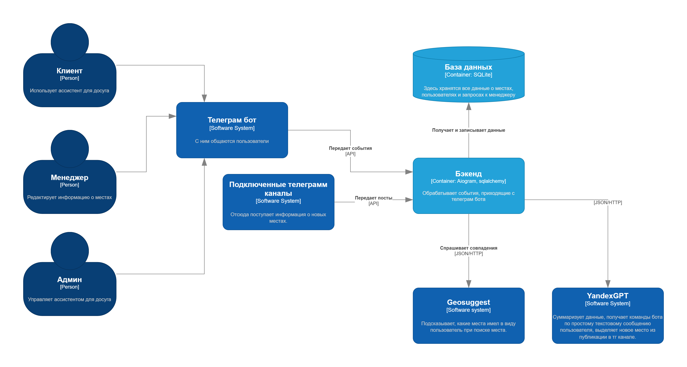

# IT_Project_MAI
Название темы: ассистент по досугу. 
Юзернейм телеграм бота: @entertainment_assistant_bot
# Участники команды
1. Бессонов Тимур (Тимлид, фронтендер)
2. Чудов Кирилл(Работа со сторонними апи, фронтендер)
3. Кузнецов Артемий(Работа с базой данных)
4. Дружинин Данил(Работа со сторонними апи)
# Стек технологий:
1. Geosuggest для точного определения места, которое имел в виду пользователь.
2. YandexGPT для суммаризаций и для "человечного" общения с ботом.
3. База данных SQLite
4. Фреймворк aiogram для самого телеграм бота

Схема по нотации C4:

# Как установить
Установите Python версии 3.12.
Создайте виртуальное окружение:
```sh
python3.12 -m venv .venv
source ./.venv/bin/activate
```

Установите библиотеки:
```sh
pip install -r requirements.txt
```

Создайте файл .env и запишите туда:
1. **BOT_TOKEN**="ваш токен телеграм бота из BotFather"
2. **GEOSUGGEST_KEY**="Ваш ключ к Geosuggest api"
3. **GPT_INDENTIFICATION**="Ключ идентификации для YandexGPT"
4. **GPT_API_KEY**="Ключ для YandexGPT API"

Запустите из папки с гит репозиторием `main.py`
```sh
python3.12 src/main.py
```
Бот запущен!